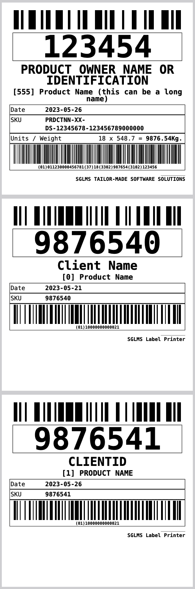

# GS1 Label Printer

PHP Label Generator and Printer (including barcodes); compatible with GS1-128 and GTIN-14.

We use this library for our own projects. It is not intended for general use; it is specific to our needs (ex. label format and size -10x10-), but it is easy to change/adapt. It's aim is simplicity, not flexibility.

## Usage

```php
use Sglms\LabelPrinter\Label;
use Sglms\LabelPrinter\Printer;

require "vendor/autoload.php";

define('TMPPATH', '/tmp'); // ¡¡¡IMPORTANT!!!

$label              = new Label(123454, 555);
$label->clientName  = "PRODUCT OWNER NAME OR IDENTIFICATION";
$label->productName = "Product Name (this can be a long name)";
$label->sku         = "PRDCTNN-XX-DS-12345678-123456789000000";
$label->generator   = "SGLMS TAILOR-MADE SOFTWARE SOLUTIONS";

// Get additional product information from GS1-128
$label->fromGS1("(01)11230000456781(37)18(3302)987654(3102)123456");

// Create the printer (PDF)
$printer = new Printer();

// Add labels
$printer->addLabel($label);

// One line
$label1  = new Label(9876540, 0, 'ClientID', 'Product Name', 'Client Name', '-5day');
$printer->addLabel($label1);

// Missing values
$label2  = new Label(9876541);
$printer->addLabel($label2);

$printer->output();

```



Download the [PDF](resources/output.pdf).

## Dependencies

After download, `composer install` will take care of all dependencies.

```bash
    "require": {
        "jaimercz/html-builder": "^0.3",
        "mpdf/mpdf": "^8.0",
        "sglms/gs1-gtin": "^1.0"
    },
```

## Contribute

All contributions are welcomed. However, keep in mind this is for our own use
